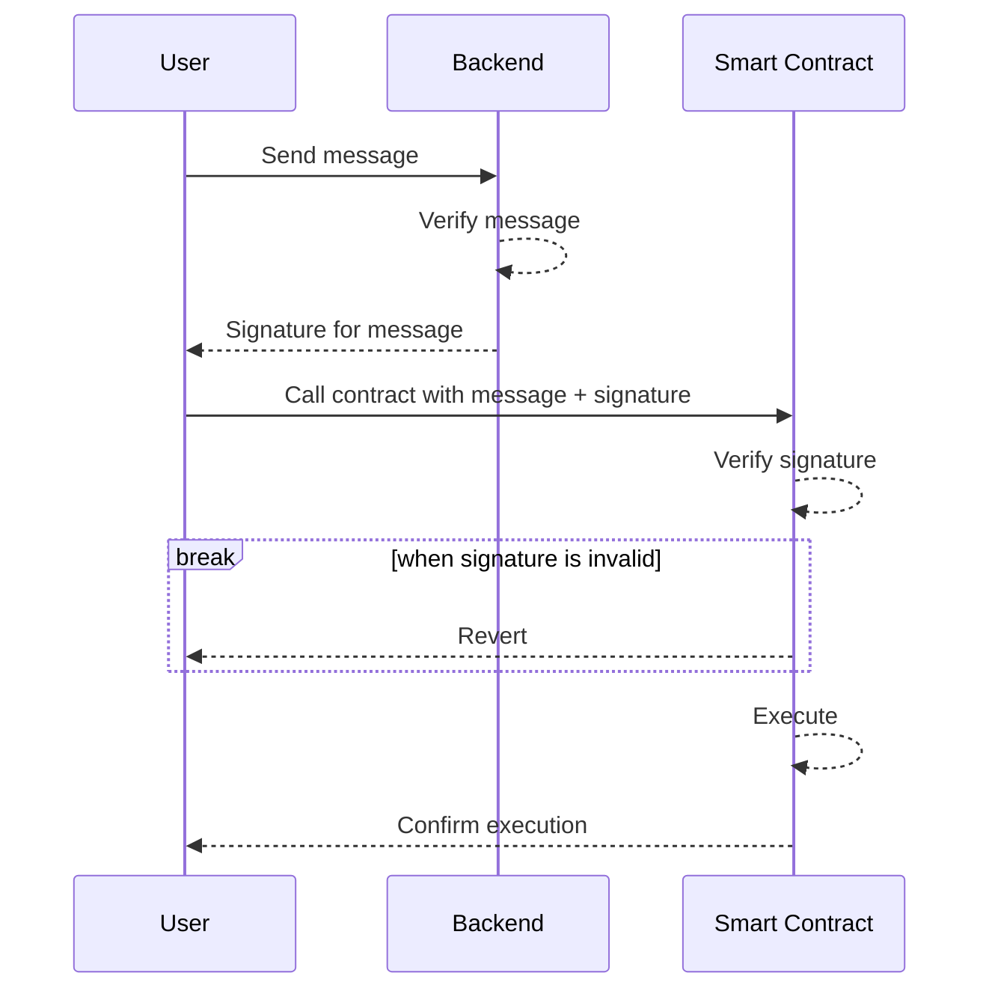

# About

Smart contract functions can be called from various sources, including users, user scripts, or other contracts. In certain situations, it may be necessary to implement off-chain verification for input information. This repository provides an example implementation of an off-chain verification layer that can be verified on-chain, by enforcing user verification of input data from a custom backend.

The sequence of steps involved in this process is as follows:




- The detailed blog article explaining this process is available at: https://blog.vechain.energy/how-to-verify-a-data-source-b6709ab6b925
- The example web application is available at: https://vechain-energy.github.io/poc-verify-source/

# Components

## Backend

```shell
wrangler init -y cloudflare-worker
yarn add ethers
```

To set up the backend:

- Configure `PRIVATE_KEY` as a secret variable
- Configure `.dev.vars` file with local secrets

## Contract

```shell
mkdir contract-verification
cd contract-verification
yarn init -y
yarn add --dev hardhat @vechain.energy/hardhat-thor @nomiclabs/hardhat-waffle
yarn add --dev "@nomiclabs/hardhat-ethers@^2.0.0" "@types/sinon-chai@^3.2.3" "ethereum-waffle@*"
yarn add --dev hardhat-jest-plugin
```

To set up the contract:

- Configure `hardhat.config.js` file with the desired deployment settings and credentials.
- Implement the contract and deployment management in the `contracts/` and `scripts/` directories.

## Others

- `index.html` file contains a working demonstration.
- `generateWallet.sh` script can be used to generate a new wallet.

### Values & Outputs

Here are some important values and outputs:

- Private Key: `0x39b5e356c1bf588ac21bf616ee571ecbeb99561d92e0ae02c5113309a366446e`
- Public Address: `0x9653fCC59c221863FAD440163dE3DA17cC399C0e`
- Echo Deployment: `0x164ad9d4291e4E0FDA6fB3d36f46c99F73d1df05`
- Backend Deployment: `https://verify-signature.example.vechain.energy/`